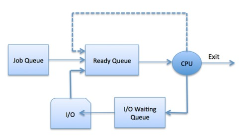

<h1 align="center">
    
</h1>
 
<h1> Student Clustering Prims </h1>

   
   
   
  

<!-- > Using the Prim algorithm to group college students on specific topics.:arrow_right: -->

----

   <a href="#memo-project">Project</a>&nbsp;&nbsp;&nbsp;|&nbsp;&nbsp;&nbsp;
   <a href="#page_with_curl-license">License</a>

## :memo: Project
The project was developed for the discipline of **Data Algorithm and Structure** of the Pontifícia Universidade Católica de Minas Gerais college, where it is proposal is to develop an algorithm that simulates the process scheduler of an operating system, using **multi thread**.

## :page_with_curl: License
This project is under the [MIT license](https://github.com/danieljpgo/process-scheduler-simulation/blob/master/LICENSE).

Released in 2019.

README update in 2020.

Developed by [Daniel Jorge](https://github.com/danieljpgo)